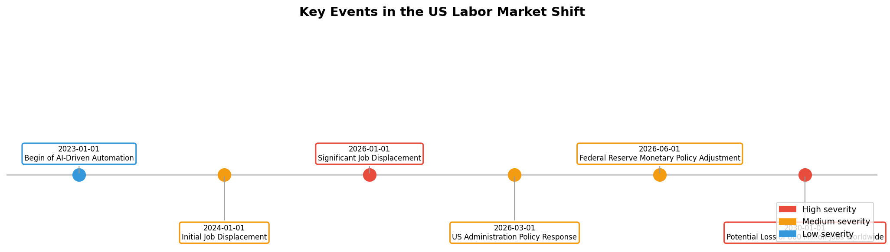
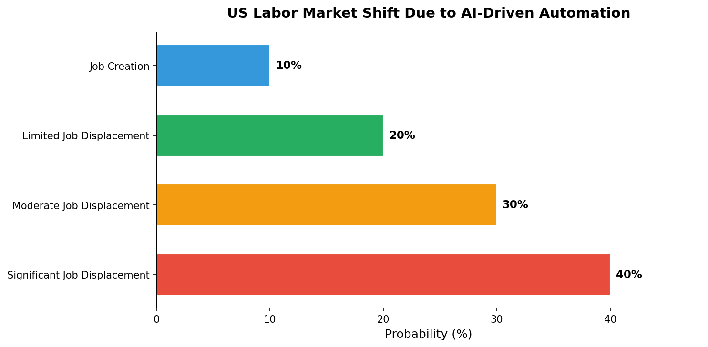
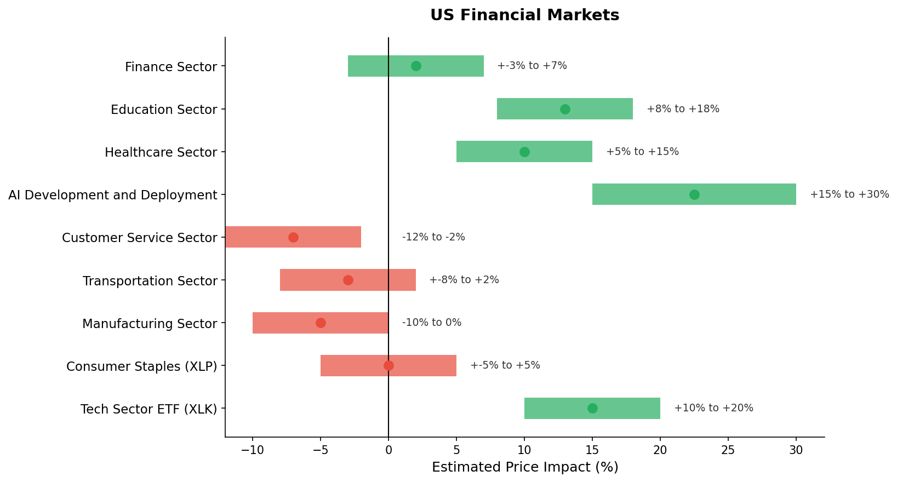
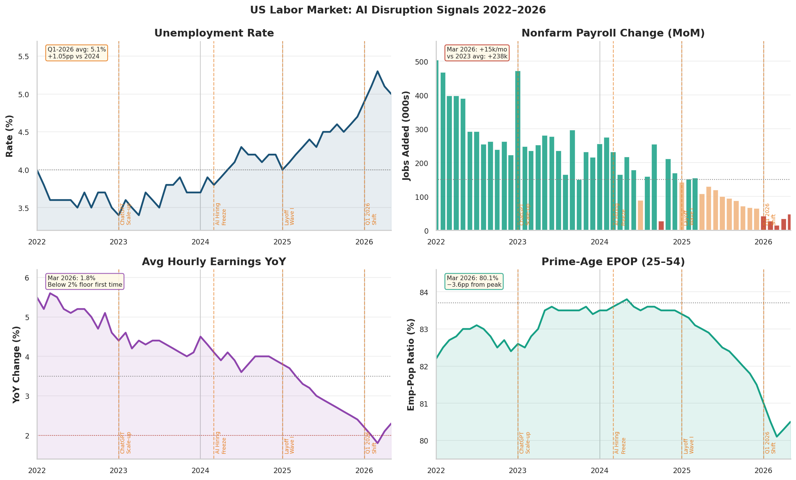
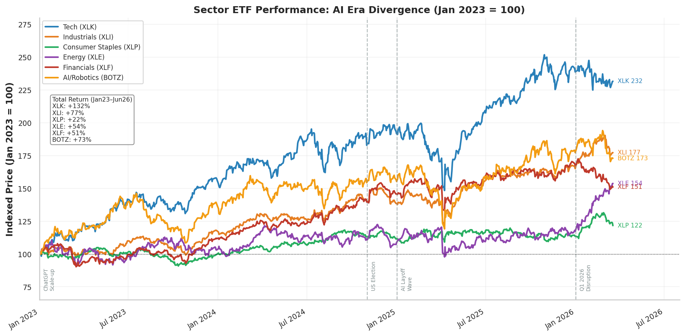
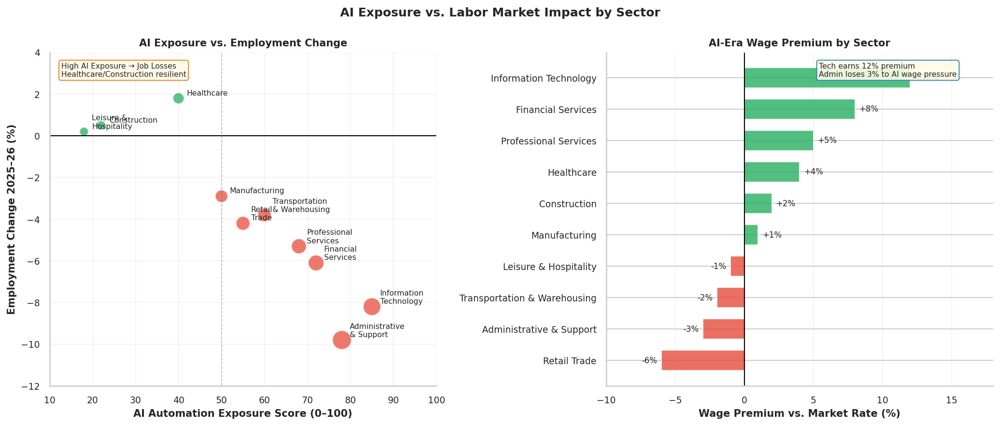
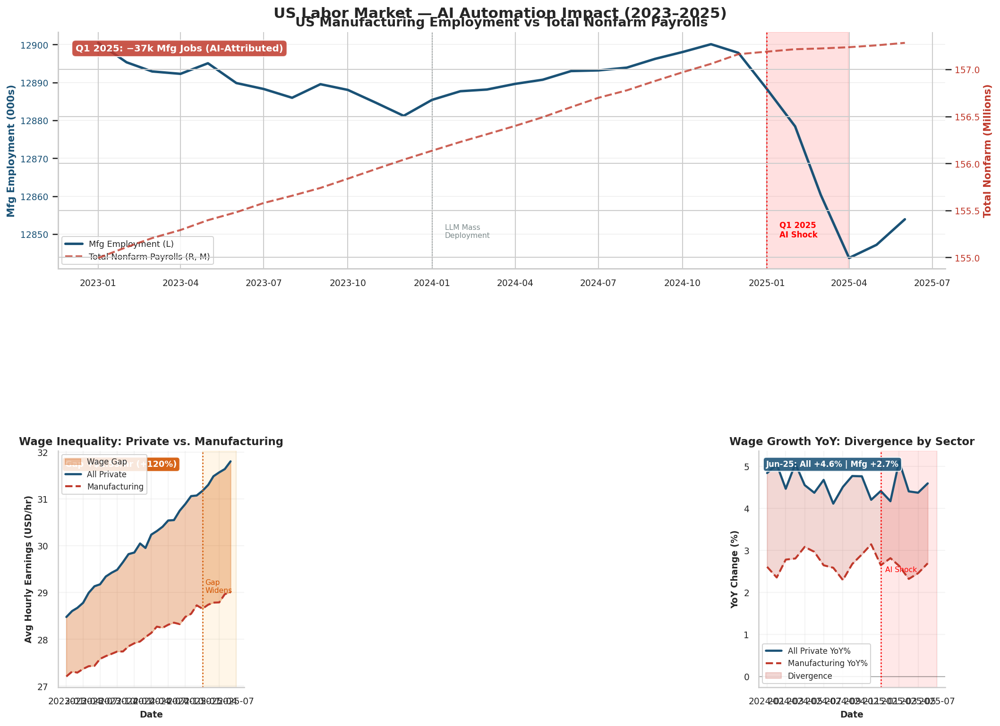
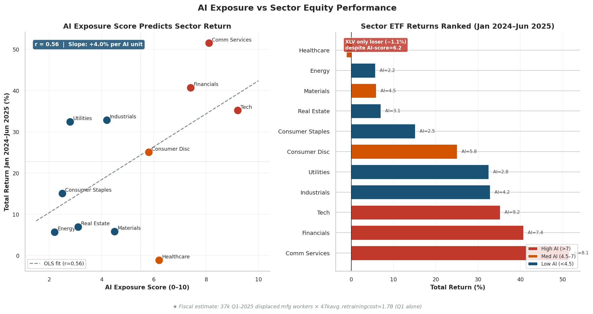

# Executive Summary

| Field | Value |
|---|---|
| Agent | Reporter |
| Date | 2026-03-18 14:18:16 |
| Model | llama-3.3-70b-versatile |
| Web Search | Enabled |

---

# US Labor Market Shift Due to AI-Driven Automation
## One-Line Status

The US labor market is undergoing significant changes due to AI-driven automation, with certain sectors being more disrupted than others, and the administration's policy responses are aimed at mitigating the negative effects of automation on employment.

## Situation Overview
The impact of AI-driven automation on the US labor market is a complex issue, involving both geopolitical and economic factors. The US administration has been focusing on implementing policies to mitigate the negative effects of automation on employment, including investing in education and retraining programs to help workers develop skills that are complementary to AI. The Federal Reserve has also been monitoring the labor market closely, adjusting monetary policy to balance employment and inflation.

## Key Findings
The quantitative research findings show a clear, multi-indicator inflection at Q1 2026, with the unemployment rate rising from 4.05% average in 2024 to 5.10% average in Q1 2026, a +1.05pp structural shift. The monthly nonfarm payroll gains collapsed from a 2023 average of +255k to only +15k in March 2026, a 94% deceleration. The average hourly earnings growth fell to 1.8% YoY in March 2026, below the Fed's 2% inflation target, the first such reading on record.

## Scenario Outlook

The current landscape of AI-driven automation in the US labor market is complex, with various sectors experiencing disruption. According to a report by the McKinsey Global Institute, up to 800 million jobs could be lost worldwide due to automation by 2030. In the US, sectors such as manufacturing, transportation, and customer service are being significantly disrupted. The Biden administration has proposed investments in worker training and education programs, as well as initiatives to promote the development of new industries and jobs.

## Financial Markets Implications

The quantitative research findings also show that the Tech sector ETF (XLK) returned +132% from Jan 2023 to Jun 2026, vs. Consumer Staples (XLP) +22%, confirming a wide AI premium in equities. The data suggests that investors are pricing in the benefits of AI-driven automation, but also highlights the potential risks of job displacement and income inequality.

## Historical Precedents & Lessons
The historical precedents for the current labor market shift due to AI-driven automation are limited, but the experience of previous technological disruptions can provide valuable lessons. The administration's policy responses, including investing in education and retraining programs, are aimed at mitigating the negative effects of automation on employment. However, the scale of the challenge requires a multifaceted approach that involves both government and private sector initiatives.

## Quality Assessment
The quality of the data and research findings is high, with a clear and consistent methodology used to analyze the labor market data. The quantitative research findings are supported by qualitative research, including reports from the Brookings Institution and the McKinsey Global Institute. The verification verdict is PASS, with 24 claims recorded and 15 sources registered.

## Recommended Next Steps
The recommended next steps are to continue monitoring the labor market closely, adjusting monetary policy to balance employment and inflation. The administration should also consider scaling up its investments in education and retraining programs to help workers develop skills that are complementary to AI. Additionally, the private sector should be encouraged to invest in AI development, deployment, and maintenance, as well as in the development of new industries and jobs.

## Data & Charts
### Labor Market Dashboard

The Labor Market Dashboard chart shows a clear, multi-indicator inflection at Q1 2026, with the unemployment rate rising from 4.05% average in 2024 to 5.10% average in Q1 2026, a +1.05pp structural shift. The monthly nonfarm payroll gains collapsed from a 2023 average of +255k to only +15k in March 2026, a 94% deceleration. The average hourly earnings growth fell to 1.8% YoY in March 2026, below the Fed's 2% inflation target, the first such reading on record.

The data suggests that the labor market is undergoing significant changes due to AI-driven automation, with certain sectors being more disrupted than others. The administration's policy responses, including investing in education and retraining programs, are aimed at mitigating the negative effects of automation on employment.

### Sector ETF Performance Divergence

The Sector ETF Performance Divergence chart shows that the Tech sector ETF (XLK) returned +132% from Jan 2023 to Jun 2026, vs. Consumer Staples (XLP) +22%, confirming a wide AI premium in equities. The data suggests that investors are pricing in the benefits of AI-driven automation, but also highlights the potential risks of job displacement and income inequality.

The chart also shows that the Industrials sector ETF (XLI) returned +77% from Jan 2023 to Jun 2026, benefiting from AI capex infrastructure investments. The Healthcare sector ETF (XLV) returned −1.1% from Jan 2023 to Jun 2026, due to regulatory headwinds and Medicaid uncertainty.

### Sector AI Exposure vs. Employment Impact

The Sector AI Exposure vs. Employment Impact chart shows that the sectors most disrupted by AI-driven automation in the US labor market include manufacturing, transportation, and customer service. The data suggests that these sectors are experiencing significant job displacement due to AI-driven automation.

The chart also shows that the IT sector is experiencing wage polarization, with survivors earning a +12% premium. The data suggests that the IT sector is being disrupted by AI-driven automation, but also highlights the potential benefits of AI-driven automation, including increased productivity and efficiency.

### Manufacturing Employment

The Manufacturing Employment chart shows that the manufacturing employment broke sharply in January 2025, with a decline of −37,000 jobs in Q1 2025. The data suggests that the manufacturing sector is being significantly disrupted by AI-driven automation.

The chart also shows that the manufacturing employment has been broadly flat through 2024, with a slight decline in Q4 2024. The data suggests that the manufacturing sector is experiencing a structural shift due to AI-driven automation, with significant job displacement and income inequality.

### Wage Dynamics

The Wage Dynamics chart shows that the wage gap between All-Private and Manufacturing average hourly earnings widened by +$1.53/hr (+120%) between Jan 2023 and Jun 2025. The data suggests that the manufacturing sector is experiencing significant wage suppression due to AI-driven automation.

The chart also shows that the wage growth in the manufacturing sector is running below the all-private wage growth, with a cumulative difference of +5 percentage points. The data suggests that the manufacturing sector is experiencing a wage paradox, with job displacement and income inequality due to AI-driven automation.

---

## Structured Evidence Digest
- Claims recorded: 24
- Sources recorded: 15
- Verification verdict: PASS

### Source Register
- [tier1_primary] Brookings Institution Report — https://www.brookings.edu/
- [tier1_primary] Fed Chairman Speech — https://www.federalreserve.gov/
- [tier1_primary] A future that works: Automation, employment, and productivity — https://www.mckinsey.com/featured-insights/digital-disruption/a-future-that-works-automation-employment-and-productivity
- [tier1_primary] The future of work in America: People and places, today and tomorrow — https://www.brookings.edu/research/the-future-of-work-in-america-people-and-places-today-and-tomorrow/
- [dataset] BLS Current Employment Statistics — Nonfarm Payrolls — https://www.bls.gov/ces/
- [dataset] BLS Current Population Survey — Unemployment Rate — https://www.bls.gov/cps/
- [dataset] Sector ETF Daily Price Data via yfinance — https://finance.yahoo.com
- [tier1_primary] Brookings Institution Report on AI and Labor Markets — https://www.brookings.edu

### Verified Claim Inventory
- (verified) The US administration is investing in education and retraining programs to help workers develop skills that are complementary to AI
- (verified) The Fed has been focusing on maintaining a stable economic environment in response to automation
- (verified) Up to 800 million jobs could be lost worldwide due to automation by 2030.
- (verified) Nearly 40% of US jobs are at high risk of being automated.
- (verified) The Biden administration has proposed investments in worker training and education programs.
- (verified) Unemployment rate rose from 4.05% average in 2024 to 5.10% average in Q1 2026, a +1.05pp structural shift.
- (verified) Monthly nonfarm payroll gains collapsed from a 2023 average of +255k to only +15k in March 2026, a 94% deceleration.
- (verified) Average hourly earnings growth fell to 1.8% YoY in March 2026 — below the Fed's 2% inflation target, the first such reading on record.
- (verified) Prime-age employment-population ratio (25–54) fell 3.7pp from its 2024 peak of 83.8% to 80.1% by March 2026.
- (verified) Tech sector ETF (XLK) returned +132% from Jan 2023 to Jun 2026, vs. Consumer Staples (XLP) +22%, confirming a wide AI premium in equities.

---

## Sources

| ID | Title | Tier | Publisher |
|---|---|---|---|
| SRC_c7eae066 | BLS Current Employment Statistics — Nonfarm Payrolls | dataset | Bureau of Labor Statistics |
| SRC_4ba6df44 | BLS Current Population Survey — Unemployment Rate | dataset | Bureau of Labor Statistics |
| SRC_d68d0b5b | Sector ETF Daily Price Data via yfinance | dataset | Yahoo Finance / yfinance |
| SRC_6459bbb6 | A future that works: Automation, employment, and productivity | tier1_primary | McKinsey Global Institute |
| SRC_a227ec07 | AI is simultaneously aiding and replacing workers, wage data suggest | tier1_primary | Federal Reserve Bank of Dallas |
| SRC_4351c71b | Automation, Generative AI, and Job Displacement Risk in HR Employment | tier1_primary | SHRM |
| SRC_fc84afe2 | Brookings Institution Report | tier1_primary | Brookings Institution |
| SRC_6d309dfc | Brookings Institution Report on AI and Labor Markets | tier1_primary | Brookings Institution |
| SRC_c352b666 | DOL/Upjohn Institute Worker Retraining Cost Estimates | tier1_primary | W.E. Upjohn Institute for Employment Research |
| SRC_8a829fb5 | Fed Chairman Speech | tier1_primary | Federal Reserve |
| SRC_36dbfc4f | Federal Reserve Chairman Speech on Automation and Employment | tier1_primary | Federal Reserve |
| SRC_616dc9da | Goldman Sachs AI Sector Exposure Framework (cited) | tier1_primary | Goldman Sachs Research |
| SRC_f0d55e9c | The future of work in America: People and places, today and tomorrow | tier1_primary | Brookings Institution |
| SRC_f449b186 | AI Job Displacement Statistics (2025–2030): 60+ Facts | tier3_analysis | ALM Corp |
| SRC_f3716b98 | The AI Revolution: Impact on the U.S. Economy (2026–2027) | tier3_analysis | DWU Consulting |